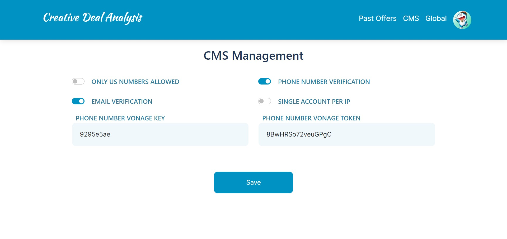
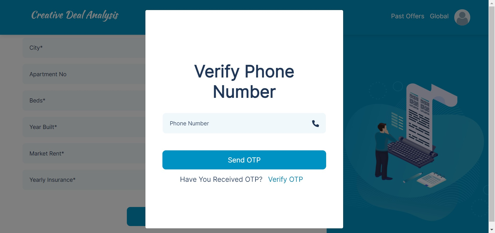

# Creative Deal Analysis Project

## Installation Guide

Follow these steps to install the Creative Deal Analysis project:

0. Clone this project using the following command:
   ```bash
   git clone git@github.com:hafizsiddiq7675/de-calculator.git

1. Navigate to the project directory:
   ```bash
   cd de-calculator
   
2. Run the following command to install project dependencies:
   ```bash
   composer update --ignore-platform-reqs

3. Copy the provided `env.example` file to `.env` and set the required credentials:
   Email credentials
   Vonage Credentials
   Google API Credentials

5. Set the database name in the `.env` file.

6. Generate an application key by running the following command:
   ```bash
   php artisan key:generate

7. Run the database migrations and seed the database:
   ```bash
   php artisan migrate --seed
   
8. Start the Laravel development server:
   ```bash
   php artisan serve
   
9. Access the project on http://localhost:8000 in your web browser.

# Coding Structure Guide

## Custom Auto load Files

- Custom auto-load files are registered in `composer.json`. The list includes:
  - Helper.php: Registers methods for public use throughout the project, e.g., `uploadFile()`, `getSlashesAboutOS()`, etc.
  - Amortization.php: Contains methods related to the Amortization subject, used for solving problems quickly in areas utilizing Amortization formulas.
  - Constants.php: Stores constants used in the project, registered and autoloaded by the Composer autoload command.
  - Response.php: Includes methods related to API responses, such as error or success responses with or without data.

## DecFormulas Library

- The DecFormulas library contains PHP conversions of Excel formulas found in Creative Deal Analysis Excel sheets. It allows easy modification of formulas, and the Offer Trait uses this library to calculate values during the creation of an Offer in different steps.

## Laravel DomPDF External Library

- This library is used when creating and finalizing an Offer. Users can send the Offer by adding the seller's email and phone number and selecting the desired amortization schedule. In the offer-sending flow, the Offer PDF is generated by the Laravel DomPdf library and then saved into the project's public folder. This PDF is attached as an email attachment to the seller.

## SignaturePad Frontend Library

- When a seller receives the Offer email with a PDF attachment, they can review the offer and sign or reject it. The SignaturePad frontend library captures the required signature. After signing, the signature is saved in the `offers` table in the database and appended as an image in the PDF on the last signature line.

## web.php Guide

- The `web.php` file handles all routes for the project. Key controllers and their associated routes include:
  - **AuthController:** Handles login, logout, verify email view, and verify email post requests.
  - **RegisterController:** Manages registration view, register post request, and verify email verification link.
  - **ForgetController:** Responsible for forget password, forget password email, reset password view, and reset password post request.
  - **ProfileController:** Deals with user profile page, update profile, and update password.
  - **OfferController:** Manages various aspects of offers, including past offers, sent offers, signed offers, rejected offers, send offer, download offer, calculate offer, calculation list, amortization listing for original, gap funding, seller carry, and owner finance. It also handles calculations for property address, entry assumptions, amounts, monthly payments, interest to equity, loan months for seller carry, purchase to requirement, remaining to interest, and other related routes.
  - **GlobalVariableController:** Handles routes related to global variables.
  - **SettingController:** Manages CMS handling, handling all routes related to settings.

# CMS Flow

<p align="center"><a href="https://creativedealanalysis.bitsoftsol.com/" target="_blank"></a></p>

In the Creative Deal Analysis project, two roles exist: Admin and User. Upon registration, a User is created, and only one Admin user exists in this project. Users with the "User" role cannot access the CMS page, while only those with the "Admin" role can access it. The CMS page contains various settings for the project.

- Email Verification:
  - Toggle the Email Verification option to enable or disable email verification for this project.
  <p align="center"><a href="https://creativedealanalysis.bitsoftsol.com/" target="_blank"></a></p>

- Phone Number Verification:
  - Toggle the Phone Verification option to enable or disable phone number verification for this project.
  - Phone number verification utilizes the Vonage Library.
  - Vonage token and Vonage Key are required for phone number verification.
  - If the Vonage token or Vonage Key is invalid, or if the Vonage message sending quota is filled, phone number verification will not be performed when the Phone Verification toggle is ON.

- US Numbers Only:
  - Toggle the US Numbers Allowed option to restrict user registration to only US numbers.
    <p align="center"><a href="https://creativedealanalysis.bitsoftsol.com/" target="_blank"></a></p>
<p align="center"><a href="https://creativedealanalysis.bitsoftsol.com/" target="_blank"></a></p>

- Single User Per IP:
  - Toggle the Only Single User Per IP option to control whether only one user can be registered per IP address.

Please note that certain settings may require specific configurations or credentials, such as Vonage token and Vonage Key for phone number verification.

# Creative Deal Analysis Working Flow

## Registration, Login, Phone Number Verification, and Email Verification

User accesses the home page of the Creative Deal Analysis Calculator and desires to use the Offer calculator form. However, the user must provide account details, such as email and password, to log in via the login popup. If the user doesn't have an account, registration is required using the register page. After registration, if the email verification toggle is enforced in the CMS, the user will be redirected to verify their email to access the Creative Deal Analysis Calculator.

If phone number verification is enforced, the user can add values in the Property Address section of the Offer Form. Clicking "Next" triggers a phone number verification popup, where the user receives an OTP on their phone to verify the phone number. After entering the phone number and clicking "Send OTP," the user verifies the OTP to gain access to all steps of Offer creation in the Creative Deal Analysis Calculator.

## Offer Create

Offer creation in the Creative Deal Analysis Calculator involves several steps:
1. **Property Address Section:** User adds details, clicks "Next" to proceed.
2. **Entry Assumptions Section:** User enters required fields, with some fields auto-calculated.
3. **Assumed Loan Section:** User enters loan details.
4. **Frontend Expenses Section:** User adds details.
5. **Seller Carry Section:** User provides seller carry details.
6. **Gap Funding Section:** User adds details.
7. **Cash Amount Section:** Last section; after submission, user is redirected to Calculation results.
After final submission, user can click on "Final Result," containing Owner Finance, Lease Option, Rental, and Slot Results calculated from the Offer form values.

## Send Offer

Upon calculating the final result, the user sees a "Send Offer" button. They can send the calculated Offer by entering the seller's email and phone number and selecting the desired amortization schedule through the Send Offer Popup. The backend generates an Offer PDF, saved in the project's public folder, and is sent as an attachment to the provided seller email. The seller can review, sign, or reject the Offer.

## Offer Listing

- **Past Offers:** Offers generated but not sent to any seller.
- **Sent Offers:** Offers sent to a seller.
- **Signed Offers:** Offers reviewed and signed by the seller.
- **Rejected Offers:** Offers reviewed and rejected by the seller.

## Amortization Schedules Tabs on Final Results

Tabs include:
- Original Amortization
- Gap Funding Amortization Schedules
- Seller Carry Amortization Schedules
- Owner Finance Amortization Schedules
All schedules are based on Offer inputs.

## Global Variables

User can change global variable values by clicking on the "Global Variables" link in the header. Default values are used in DecFormulas to calculate Offer results based on inputs. Default global variable values are saved for each new user.

## Profile Page

In the profile page (accessible by clicking the profile button on the header), users can change profile pictures and information. Password changes can also be made from this page.


