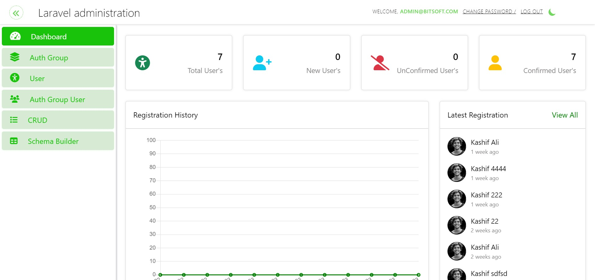

## About Laravel Administration

Laravel Administration library provides the facility to developer to create only model. Then if developer use the LaravelAdmin Trait in that model then, he/she not need to perform the crud operations like create routes, views and controller logics. Laravel administration will provide autometically crud operations, you can check from your interface by requesting the URL app-base-url/admin.

If developer use the LaravelAdminAPI trait in model. Then laravel administration package will provide the all apis for crud, developer not need to perform create, read, list and delete apis for that model. Developer only need to get the model id and set that model ID into Postman attached collection and test the all apis after authentication.

## Installation and Usage Instructions

You can install and use package by performing these instructions
<h3>Create AUTO CRUD</h3>
<ol>
    <li><b>composer require create-project laravel/laravel LaravelAdministration</b></li>
    <li>Migration the migrations files and seed <b>Php artisan migrate:fresh --seed</b></li>
    <li>To make new Model with Migration <b>php artisan make:model CrudTester -m </b></li>
    <li>Inside the DemoCRUD model add Trait in this way <b>use LaravelAdmin</b></li>
    <li>You can edit migration <b>Make Fields of DemoTester like, teser_name, tester_email, tester_image, tester_is_verified</b></li>
    <li>Migrate the DemoTester migration <b>php artisan migrate</b></li>
    <li>You can serve <b>php artisan serve</b></li>
    <li>Go to url <b>base-url/admin</b></li>
    <li>Login and Go to <b>base-app-url/admin/crud</b> </li>
    <li>If DemoTester Model use LaravelAdmin trait and DemoTester Migration is migrated then DemoTester will be displayed in list.</li>
    <li>Click on DemoTesterModel and can test all crud operations</li>
    <li>Set the fillable fields array in DemoTester Model to show the fields, you want to display in Listing</li>
    <li>You can add new DemoTester record, update and Delete the record.</li>
</ol>

<h3>Build Your Own Schema</h3>
<ol>
    <li>From Schema Builder tab, You can create a Model with migration by Clicking on Add new button</li>
    <li>Add name for model and click on save button to define the schema fields for that model and Check the LaravelAdmin trait will be used or not.</li>
    <li>After defining the fields of schema for that model you can edit the migration and model file.</li>
    <li>You can edit migration and model before migrating</li>
    <li>After clicking on migrate, you will not be able to edit files.</li>
    <li>If your created model in schema builder contains LaravelAdmin trait then you can view CRUD of that model in CRUD tab</li>
</ol>

<h3>API Auto CRUD</h3>
<ol>
    <li>If you need all crud apis for the created model, then you need to use another trait named as <b>*LaravelAdminAPI*</b></li>
    <li>Open the postman attached collection, import the collection and environment variables file on postman.</li>
    <li>
        <h5>Postman Guide</h5>
        <a href="public/readme-assets/postman/Laravel-Administration.postman_collection.json" download>LaravelAdministration Collection</a>  
        <a href="public/readme-assets/postman/Laravel-Administration.postman_environment.json" download>LaravelAdministration Evnvironment</a>  
    </li>
    <li>You need to authenticate from login api first.</li>
    <li><b>{{host}}/api/admin/crud/models</b> 
        Model listing, from that api you can access all your models in which you use the LaravelAdminAPI trait and have been migrated. </li>
    <li>You can pick model id and set that model_id into environment variable.</li>
    <li>After setting the model_id as environment variable, you can test all crud apis for that model.</li>
    <li>For the Update data Api, you can use same Store API by passing the *id* field value.</li>
</ol>

You may also try the [Laravel Bootcamp](https://bootcamp.laravel.com), where you will be guided through building a modern Laravel application from scratch.

If you don't feel like reading, [Laracasts](https://laracasts.com) can help. Laracasts contains over 2000 video tutorials on a range of topics including Laravel, modern PHP, unit testing, and JavaScript. Boost your skills by digging into our comprehensive video library.

## Laravel Sponsors

We would like to extend our thanks to the following sponsors for funding Laravel development. If you are interested in becoming a sponsor, please visit the Laravel [Patreon page](https://patreon.com/taylorotwell).

### Premium Partners

- **[Vehikl](https://vehikl.com/)**
- **[Tighten Co.](https://tighten.co)**
- **[Kirschbaum Development Group](https://kirschbaumdevelopment.com)**
- **[64 Robots](https://64robots.com)**
- **[Cubet Techno Labs](https://cubettech.com)**
- **[Cyber-Duck](https://cyber-duck.co.uk)**
- **[Many](https://www.many.co.uk)**
- **[Webdock, Fast VPS Hosting](https://www.webdock.io/en)**
- **[DevSquad](https://devsquad.com)**
- **[Curotec](https://www.curotec.com/services/technologies/laravel/)**
- **[OP.GG](https://op.gg)**
- **[WebReinvent](https://webreinvent.com/?utm_source=laravel&utm_medium=github&utm_campaign=patreon-sponsors)**
- **[Lendio](https://lendio.com)**

## Contributing

Thank you for considering contributing to the Laravel framework! The contribution guide can be found in the [Laravel documentation](https://laravel.com/docs/contributions).

## Code of Conduct

In order to ensure that the Laravel community is welcoming to all, please review and abide by the [Code of Conduct](https://laravel.com/docs/contributions#code-of-conduct).

## Security Vulnerabilities

If you discover a security vulnerability within Laravel, please send an e-mail to Taylor Otwell via [taylor@laravel.com](mailto:taylor@laravel.com). All security vulnerabilities will be promptly addressed.

## License

The Laravel framework is open-sourced software licensed under the [MIT license](https://opensource.org/licenses/MIT).
"# CreateReadMe" 
